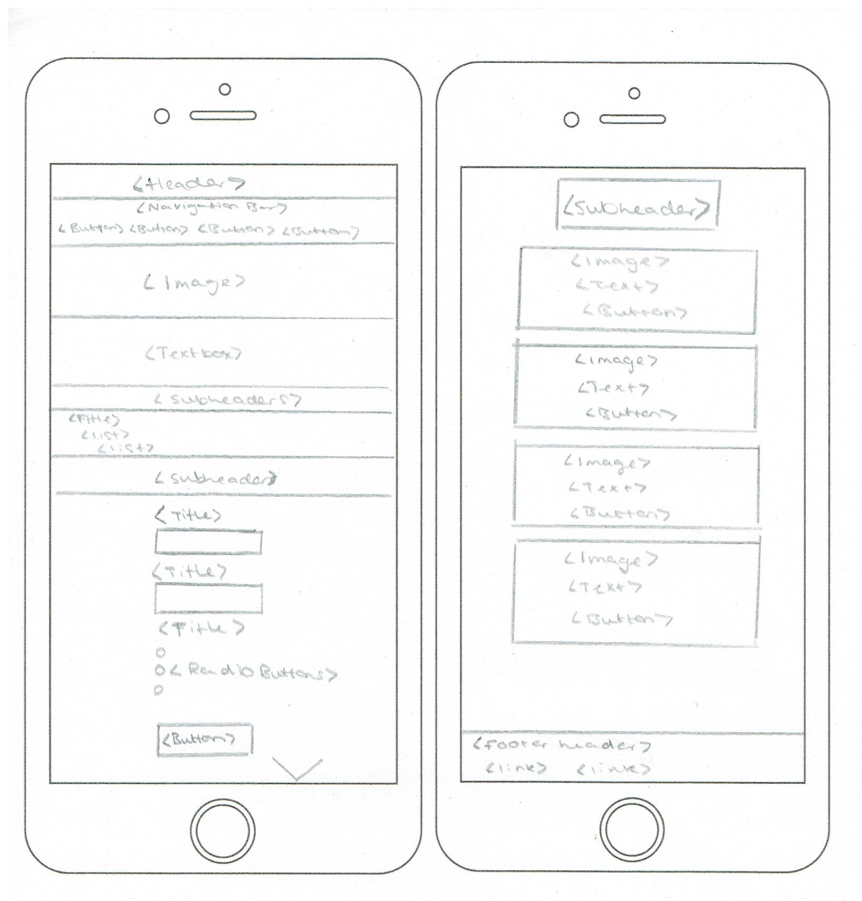
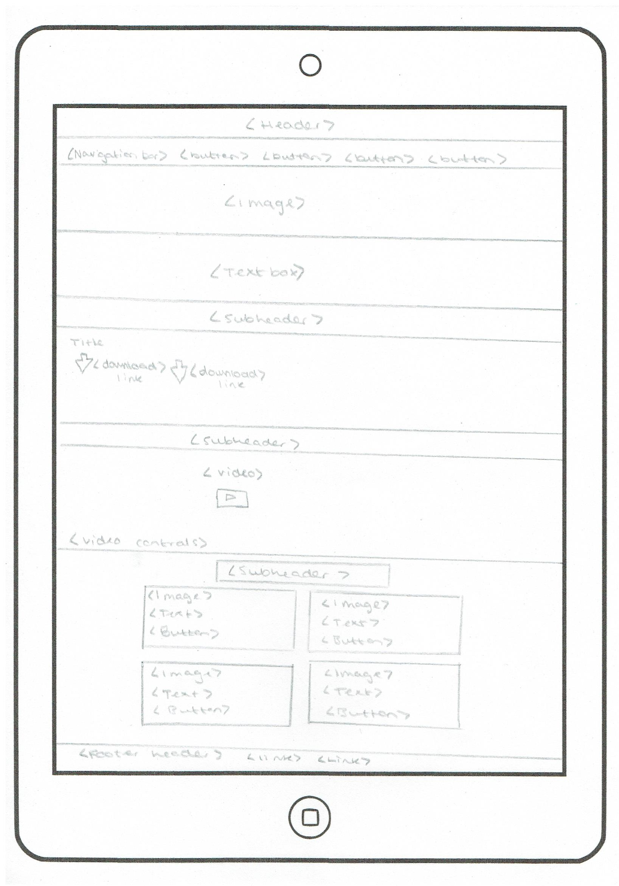
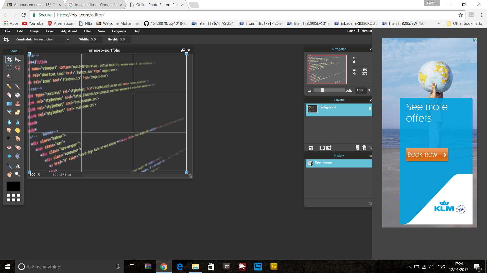
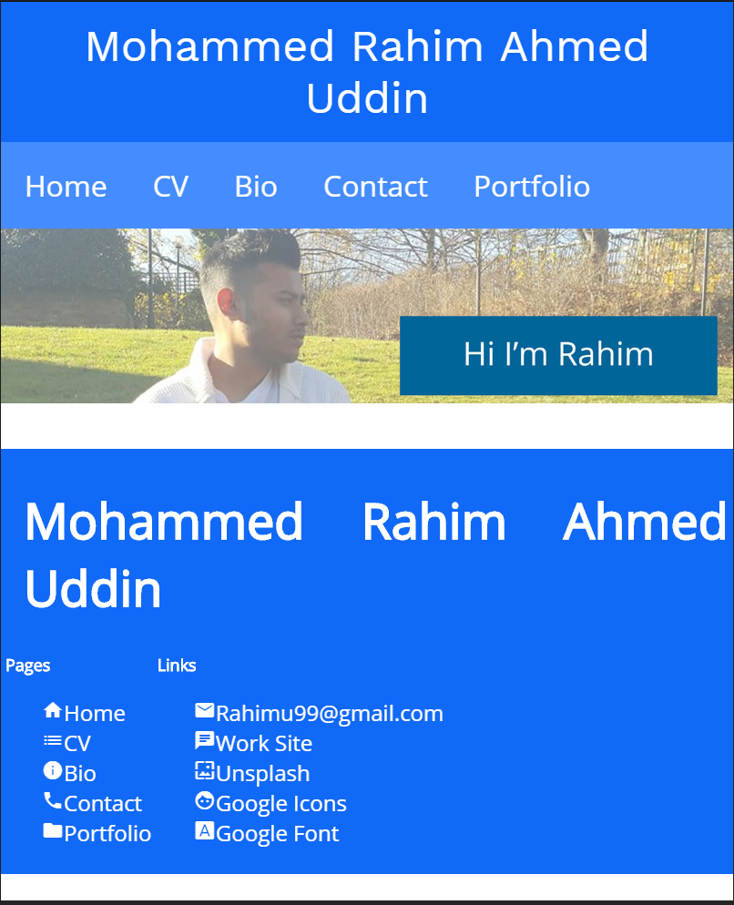
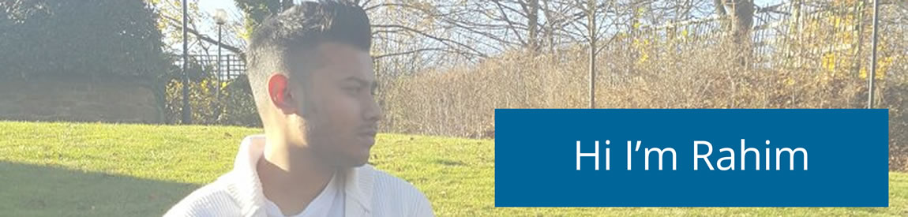
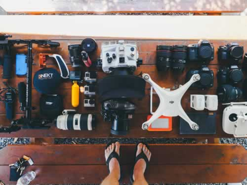
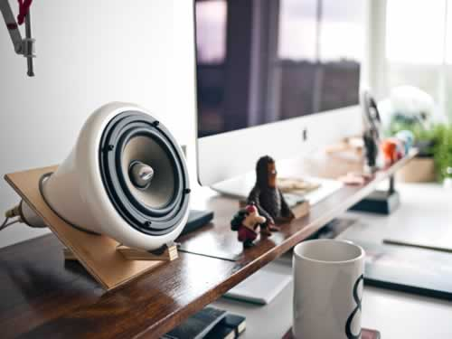
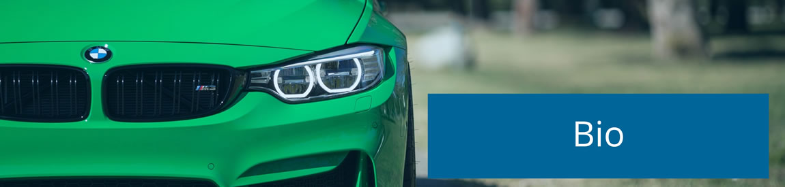
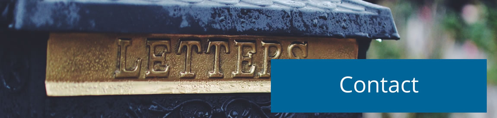

# Name: Mohammed Rahim Ahmed Uddin

# Student Number: 16428878

# GitHub 'live' URL: <https://github.com/16428878/csy1018-assign1>

# Assignment 1: Web Development

# Submission Date: 14th January 2017

# csy1018-assign1

## Web Development Assignment-1

### Supporting Documentation

#### The supporting documentation, will show the progression of the web development project, from the beginning all the way to the complete website with all pages fully working, therefore all the milestones taken along the way will be discussed in detail and with evidence to show the path that has been taken when creating the site.

#### There was several different stages that was taken during this project, the first one being research; to help understand the project better, then sketches; to get preliminary designs together, then wireframes, to get gauge a more finished plan, to prototypes; to see sample of finished products to make final judgements, and finally progression of work to create the final project, therefore below each section will be discussed in detail to show you how the project developed.

### Research Stage

#### The first section that will be discussed is research; which is essential as this allowed for the correct knowledge to be picked up before starting to create the site, as similar cv website, were looked at to gain a sense of direction in terms of design and content, allowing for a better understanding of the project.

#### There was several different website that were looked at to understand what is being looked for in terms of design when it comes to creating a cv website, therefore due to the project wanting to be fit for purpose several modern clean UI websites where viewed, these include:

- <http://thalida.com/>
- <http://jessdesigntan.com/>
- <http://www.albinotonnina.com/>

#### After analysis, the websites allowed for better understanding of how modern cv website should look and therefore there was several key points that were taken away from the research that will be vital to making sure the projects site is successful, these include:

#### One key design feature that can be taken away is the use of colours, as all sites used colours modestly in terms of the number of different colours used, as all websites used one primary colour and a secondary accent colour, this allowed for the website to stand out and pop, but at the same time still look professional and allowing the content to take center stage.

#### The second key design feature that can be taken away from the examples was the use of responsive pages, that have set breakpoints for mobile and desktop to allow the website to best suite the platform that is on so the user can experience the website in the best possible manner.

#### The final design feature that can be taken away from the research of the examples was the use of High Quality images to break up text used on the website to make users stay attentive when viewing the site, making for a more user engaging experience.

#### In conclusion cv content, design features that are relevant to modern design are the main points that were uncovered in the research stage of the project.

### Sketches

#### Moving onto the sketch section of the project, sketches will be created to get preliminary designs together, this allows for a rough concept to be created to give the project a direction of how the pages should be styled in the most simplest form, therefore below all sketches for different platform will be evidenced.

### Desktop Sketches

#### Below all the desktop sketches have been evidenced, these have been created to outline the preliminary design of all the desktop pages structures and designs.

### Desktop Home

#### Below is the desktop home page, with the basic structure that is needed for the page, this includes no margins for the components that span all the way across, this gives the page a more modern clean look, also navigation bar is beneath the header of the page and followed by a large image and text, below that is 2 sets of sub headers and navigation buttons that are evenly margined and this is capped off with the footer that has no margin and includes several different links.

#### Good Points: The reason for choosing this particular design is due to the large image giving a focal point to the page that will attract the user, above this a navigation bar that spans the whole site to offer easy accessibility and navigation through out the site.


### Desktop CV

#### Below is the desktop CV page, with the basic structure that is needed for the page, this includes no margins for the components that span all the way across, this gives the page a more modern clean look, also navigation bar is beneath the header of the page and followed by a large image and text, below that is 6 sets of sub headers and list style information heavy content that are evenly margined and this is capped off with the footer that has no margin and includes several different links.

#### Good Points: The reason for choosing this particular design is due to the use of sub headers and unordered list, that give the cv page more structure due to it holding so much text content the list format allows for it to be easily understood and followed by the user.


### Desktop Bio

#### Below is the desktop Bio page, with the basic structure that is needed for the page, this includes no margins for the components that span all the way across, this gives the page a more modern clean look, also navigation bar is beneath the header of the page and followed by a large image and text, below that is 1 set of sub headers and list style information heavy content that are evenly margined, below is 2 sets of 4 navigation buttons and this is capped off with the footer that has no margin and includes several different links.

#### Good Points: The reason for choosing this particular design is due to the use of article style box of information this allows for content to shown individually, whilst being besides each other allowing for content to be structured in a way where more content is available on the viewers initial view range.


### Desktop Contact

#### Below is the desktop Contact page, with the basic structure that is needed for the page, this includes no margins for the components that span all the way across, this gives the page a more modern clean look, also navigation bar is beneath the header of the page and followed by a large image and text, below that is 1 set of sub headers and list style information heavy content and 1 form that are evenly margined and this is capped off with the footer that has no margin and includes several different links.

#### Good Points: The reason for choosing this particular design is due to the use the range of different options available in the form that has been designed, as the form uses different techniques such as text field, text areas and radio buttons to achieve a comprehensive form.


### Desktop Portfolio

#### Below is the desktop Portfolio page, with the basic structure that is needed for the page, this includes no margins for the components that span all the way across, this gives the page a more modern clean look, also navigation bar is beneath the header of the page and followed by a large image and text, below that is 1 set of sub headers and list style for downloadable content and 1 video that are evenly margined and this is capped off with the footer that has no margin and includes several different links.

#### Good Points: The reason for choosing this particular design is due to the use the of a video that has the ability to change resolution to whatever display size but also has built in video controls to allow the user to control video and volume operations.


### Tablet And Mobile Sketches

#### Below all the tablet and mobile sketches have been evidenced, these have been created to outline the preliminary design of all the devices pages structures and designs.

### Tablet And Mobile Home

#### Below is the tablet home page, the differences in structure for the tablet version compared to the desktop design is that the break points for the article style boxes and for the navigation boxes is that they are a 2 sets of 2 allowing the content to be more readable on the tablet.


#### Below is the mobile home page, the differences in structure for the mobile version compared to the desktop design is that the break points for the article style boxes and for the navigation boxes is that they are a 4 sets of 1 allowing the content to be more readable on the mobile.


### Tablet And Mobile CV

#### Below is the tablet cv page, the differences in structure for the tablet version compared to the desktop design is that the break points for the article style boxes and for the navigation boxes is that they are a 2 sets of 2 allowing the content to be more readable on the tablet.


#### Below is the mobile cv page, the differences in structure for the mobile version compared to the desktop design is that the break points for the article style boxes and for the navigation boxes is that they are a 4 sets of 1 allowing the content to be more readable on the mobile.


### Tablet And Mobile Bio

#### Below is the tablet bio page, the differences in structure for the tablet version compared to the desktop design is that the break points for the article style boxes and for the navigation boxes is that they are a 2 sets of 2 allowing the content to be more readable on the tablet.


#### Below is the mobile bio page, the differences in structure for the mobile version compared to the desktop design is that the break points for the article style boxes and for the navigation boxes is that they are a 4 sets of 1 allowing the content to be more readable on the mobile.


### Tablet And Mobile Contact

#### Below is the tablet contact page, the differences in structure for the tablet version compared to the desktop design is that the break points for the article style boxes and for the navigation boxes is that they are a 2 sets of 2 allowing the content to be more readable on the tablet.


#### Below is the mobile contact page, the differences in structure for the mobile version compared to the desktop design is that the break points for the article style boxes and for the navigation boxes is that they are a 4 sets of 1 allowing the content to be more readable on the mobile.



### Tablet And Mobile Portfolio

#### Below is the tablet portfolio page, the differences in structure for the tablet version compared to the desktop design is that the break points for the article style boxes and for the navigation boxes is that they are a 2 sets of 2 allowing the content to be more readable on the tablet.



#### Below is the mobile portfolio page, the differences in structure for the mobile version compared to the desktop design is that the break points for the article style boxes and for the navigation boxes is that they are a 4 sets of 1 allowing the content to be more readable on the mobile.


### Wireframes

#### Moving onto the wireframes section of the project, these will be created to get a more detailed design together and therefore will give us in a digitally space a more rigid and structured version of plans to allow for a more accurate diagram of how the final pages will look, therefore below all the wireframes for different platforms will be evidenced.

### Desktop Wireframes

#### Below all the desktop wireframes have been evidenced, these have been created to show a more detailed plan of the webpages in terms of content, design and structure.

### Desktop Home

#### Below is the desktop home page wireframe, starting from the top you have the header of the webpage centered, below you have the navigation bar aligned to the left, below that the main image that spans side to side with a welcome message below, following that is a centered sub header with 4 images with text set on 1 row, followed by another sub header that is centered, which has 4 navigation boxes with links spanning a single row, this is then capped of with a footer that includes a header and links to internal and external pages.

#### Good Points: One good point of this page is that a welcome message is included this allows for the user to be first greeted when entering the landing page, engaging with the users and making them want to explore on further.


### Desktop CV

#### Below is the desktop cv page wireframe, starting from the top you have the header of the webpage centered, below you have the navigation bar aligned to the left, below that the main image that spans side to side with a welcome message below, following that is a centered sub header with cv details split into 6 sections, followed by another sub header that is centered, which has 4 navigation boxes with links spanning a single row, this is then capped of with a footer that includes a header and links to internal and external pages.

#### Good Points: One good point of this page is that all cv content that is essential is covered on this single page, as personal details, education current courses, personal experience, skills and activities were deemed essential by monster cv who help build cv, making the page comprehensive in terms of the cv content shown.


### Desktop Bio

#### Below is the desktop bio page wireframe, starting from the top you have the header of the webpage centered, below you have the navigation bar aligned to the left, below that the main image that spans side to side with a welcome message below, following that is a centered sub header with bio details in 1 section, followed by another sub header that is centered, which has 4 navigation boxes with links spanning a single row, this is then capped of with a footer that includes a header and links to internal and external pages.

#### Good Points: One good point of this page is that small facts that are brief and to the point are written in the image boxes, this allows the users to learn information in a small dosage instantly due to the form they are delivered in.


### Desktop Contact

#### Below is the desktop contact page wireframe, starting from the top you have the header of the webpage centered, below you have the navigation bar aligned to the left, below that the main image that spans side to side with a welcome message below, following that is a centered sub header with contact details split into 1 section, below this is a contact form that includes business quires, contact info and message box that can be submitted directly, followed by another sub header that is centered, which has 4 navigation boxes with links spanning a single row, this is then capped of with a footer that includes a header and links to internal and external pages.

#### Good Points: One good point of this page is that the user can directly contact the website holder by using the direct form, this means there is less boundaries between the contact allowing, for more users to use due to the ease of using it.


### Desktop Portfolio

#### Below is the desktop portfolio page wireframe, starting from the top you have the header of the webpage centered, below you have the navigation bar aligned to the left, below that the main image that spans side to side with a welcome message below, following that is a centered sub header with download items in 1 section, below this is a video that spans the width of the page including video controls below, followed by another sub header that is centered, which has 4 navigation boxes with links spanning a single row, this is then capped of with a footer that includes a header and links to internal and external pages.

#### Good Points: One good point of this page is that items can be download from the website so that they can be viewed offline, this allows the user to have gain extra functionality form the site due to items being able to run offline.


### Tablet And Mobile Wireframes

#### Below all the tablet and mobile wireframes have been evidenced, these have been created to show the structure of the webpages across platform in more detail in terms of both content and structure.

### Tablet And Mobile Home

#### Below is the tablet home page, the differences in structure for the tablet version compared to the desktop design is that the break points for the article style boxes and for the navigation boxes is that they are a 2 sets of 2 allowing the content to be more readable on the tablet.


#### Below is the mobile home page, the differences in structure for the mobile version compared to the desktop design is that the break points for the article style boxes and for the navigation boxes is that they are a 4 sets of 1 allowing the content to be more readable on the mobile.

 

### Tablet And Mobile CV

#### Below is the tablet cv page, the differences in structure for the tablet version compared to the desktop design is that the break points for the article style boxes and for the navigation boxes is that they are a 2 sets of 2 allowing the content to be more readable on the tablet.

 

#### Below is the mobile cv page, the differences in structure for the mobile version compared to the desktop design is that the break points for the article style boxes and for the navigation boxes is that they are a 4 sets of 1 allowing the content to be more readable on the mobile.

 

### Tablet And Mobile Bio

#### Below is the tablet bio page, the differences in structure for the tablet version compared to the desktop design is that the break points for the article style boxes and for the navigation boxes is that they are a 2 sets of 2 allowing the content to be more readable on the tablet.


#### Below is the mobile bio page, the differences in structure for the mobile version compared to the desktop design is that the break points for the article style boxes and for the navigation boxes is that they are a 4 sets of 1 allowing the content to be more readable on the mobile.

 

### Tablet And Mobile Contact

#### Below is the tablet contact page, the differences in structure for the tablet version compared to the desktop design is that the break points for the article style boxes and for the navigation boxes is that they are a 2 sets of 2 allowing the content to be more readable on the tablet.


#### Below is the mobile contact page, the differences in structure for the mobile version compared to the desktop design is that the break points for the article style boxes and for the navigation boxes is that they are a 4 sets of 1 allowing the content to be more readable on the mobile.

 

### Tablet And Mobile Portfolio

#### Below is the tablet portfolio page, the differences in structure for the tablet version compared to the desktop design is that the break points for the article style boxes and for the navigation boxes is that they are a 2 sets of 2 allowing the content to be more readable on the tablet.


#### Below is the mobile portfolio page, the differences in structure for the mobile version compared to the desktop design is that the break points for the article style boxes and for the navigation boxes is that they are a 4 sets of 1 allowing the content to be more readable on the mobile.

 

### Prototypes

#### Below a very simple prototype was created just for the home page, to gauge an idea of how the final product will look before properly starting to create the web project, this would give the project the final nudge before starting to see if the designs created are suitable and how they look on a finished product.

#### Below you will see the prototype created for the home page, this includes the colour scheme which includes blue's and neutral tones and in terms of font open sans and san serif are being used to see if the design aspects will fit together and look right, in this case the styles work together and therefore is go ahead.


### Models Of Good Practice

#### There are several models of good practice that can be implemented when creating a website, these can help to make the users end experience better and make the website more user friendly to the end users, making the web projects stand out compared to other, these include:

#### One model of good practice that's being used is speed optimization in order to do this all part of the website will be optimize including images and media, will be reduced in size to the lowest sizes possible without disrupting the quality of the media to make sure the webpages can load in the fastest time possible.


#### Another model of good practice that is being used is clear and several paths of navigation, this include navigation bars, buttons and footer navigation, all of these aspects equal good use of navigation, as by making it easier to find forms of navigation it makes it easier for user to navigate them selves around the site more quicker, making the user experience better, and appealing to users more.


#### Another model of good practice that is being used is in the site being developed is the use of material design, which has been researched on googles material design website, showing how to use flat objects and how to style a website in that fashion, allowing for a clean looking modern website that looks visually appealing.

#### The fifth model of good practice being used is the use of white space, as using blank white space to your advantage can leave a webpage feeling modern and easier to consume for the end user, making it more appealing for users to explore.

#### The final model of good practice is to provide the users with help and instructions, this includes place holder in forms, telling the users what exactly needs to be inputted where and link buttons to get users to certain section s can be seen to aid the users and make their experience of the site better for it as it will allow for a smoother user experience.

### Image editing and optimization

#### In terms of image optimization and editing all images on the website where editing using several different programs including adobe photoshop when available but at most part an online editor called pixlr was used to reduce the size of the images to a more compressed size that would allow for the page to load faster but not destroy the quality of the image at the same time, below an example can be seen of the editor in use.



### Progression of Site

### 1st Session (5hrs 30mins)

#### In this session of creating the website the html page was set up and created for the index.html page, in addition to this the navigation bar was created, housing all the links for the other 4 pages and the image that spans the entire width was also added, the style has also been added to the css style sheet.


### 2nd Session (3hrs 10mins)

#### In todays session, work was carried on from the index.html page, to create the basic page, today the footer of the website , which is a sticky footer was created, this includes a footer header, a pages column that includes internal links and a links column that includes external links to other sites, the styling of the footer has been done in the css style sheet.



### 3rd Session (6hrs 25mins)

#### In todays session, work has been finished on the index.html page, as the 2 sub headers have rows of 4 boxes have been added, the first row being 4 images with header descriptions, and the second row having images, headers, text and buttons that links to other pages, the styling for the boxes have been added to the css style sheet that is linked.


### 4th Session (6hrs 40mins)

#### In todays session, the cv page has been completed, this has been done by copying the bulk of the code form the index.html page; to create the basis of the page, afterwards 6 extra sub headers and textbox have been added and unordered list have been written in all of them to write the information out for all the content on the cv page, the styling for the sub headers and textboxes and lists have been added to the css stylesheet.


### 5th Session (4hrs 20mins)

#### In todays session, the bio page has been completed, this was done by copying the bulk of the code form the index.html page; to create the basis of the page, afterwards the main image has been changed, the welcoming message text has been altered, then1 new sub header and text box with a unordered list has been added and the 4 image boxes with description have been edited to have different images and text, but no styling has had to be done therefore the stylesheet has not been touched today.


### 6th Session (5hrs 45mins)

#### In today session, the contact page has been created, in order to do this so quickly majority of the code ahs been brought across from the bio.html page and the main image and text has been edited, below that the sub header and textbox with unordered list where altered to include the contact information, apart form that the lengthily process today was adding another sub header and text box and creating the form, which includes 4 text fields, 1 option list, 1 text area and a submit button, but also place holders where added, this took the most time of todays session, apart from this , the css style sheet has added form styling to style the form to match the house style.


### 7th Session

#### In todays session, the final page which is the portfolio page has been created, in order to do this have the majority of code from the bio.html has been taken and the main image and welcoming messages have been altered, apart from this the first text box has been edited to include images that when clicked open a link to download items to the computer for downloadable items and below that an additional text box has been added and a video source has been added with controls to complete the portfolio page.


### Code Used From Other Sources

Below is the code that has been used form other sources to help create the website, these include:

- <https://css-tricks.com/perfect-full-page-background-image/>

  #### The code that has been used from them is the code for the main image on all pages which includes:

  ```
  <div class="row row-margin-bottom">
      <div class="col-md-5 no-padding lib-item" data-category="view">
          <div class="lib-panel">
              <div class="row box-shadow">
                  <div class="col-md-6">
                      
                  </div>
              </div>
          </div>
      </div>
  </div>
  ```

- <http://codepen.io/UoN-ThomasRose/pen/NbYrGj>

  #### The code that has been used from them is the code for the main image on all pages which includes:

  ```
  <div class="option-list">
    <fieldset>
        <legend>
            <sub1>Related Business</sub1>
        </legend>
        <label><input type="radio" name="rb1">Web Development</label> <br>
        <label><input type="radio" name="rb1">Software Engineering</label> <br>
        <label><input type="radio" name="rb1">Programming</label> <br>
        <label><input type="radio" name="rb1">Other</label>
    </fieldset>
  ```

### Web Development Project Code

### index.html

```
<!DOCTYPE html>
<html>
<!--The header tag includes the page title,which is index.html,present is also the link css style sheet, google font style sheet and google icon style sheet link.-->

<head>
    <meta charset="utf-8">
    <title>index.html</title>
    <link rel="stylesheet" href="css/style.css">
    <link href="https://fonts.googleapis.com/css?family=Alike+Angular|Asul|Concert+One|Eczar|Fruktur|Kavoon|Neuton|Open+Sans|Space+Mono|Tillana|Work+Sans" rel="stylesheet">
    <link href="https://fonts.googleapis.com/icon?family=Material+Icons" rel="stylesheet">
</head>
<!--The body of the index page begins here -->

<body>
    <!-- Below is the header of the webpage, the naviagtion bar with 5 pages all linked -->
    <header>Mohammed Rahim Ahmed Uddin</header>
    <div class="wrapper">
        <ul class="topnav" id="myTopnav">
            <li><a href="index.html">Home</a></li>
            <li><a href="cv.html">CV</a></li>
            <li><a href="bio.html">Bio</a></li>
            <li><a href="contact.html">Contact</a></li>
            <li><a href="portfolio.html">Portfolio</a></li>
        </ul>
    </div>
    <!-- Below is the main image for the webpage, this is in the div class below to make it responsive and span the whole page -->
    <div class="container">
        <div class="row row-margin-bottom">
            <div class="col-md-5 no-padding lib-item" data-category="view">
                <div class="lib-panel">
                    <div class="row box-shadow">
                        <div class="col-md-6">
                            
                        </div>
                    </div>
                </div>
            </div>
        </div>
    </div>
    <!--Below is the textbox holding the description of the page, this includes animation that is being used-->
    <div class="textbox">
        <div class="wrapper4">
            <h1>I'm a web developer...</h1>
            <h1>...who <p2>loves</p2> to interact with clients with enthusiasm...</h1>
            <h1>...but is also a <p3>realist</p3> when it comes to graft and not just another "yes" man, who will not deliver.</h1>
        </div>
    </div>
    <!--Below is the sub heading,centered-->
    <div class="wrapper">
        <p> </p>
        <sub>Facts About Me</sub>
        <p> </p>
    </div>
    <!-- Below is 4 images that have descriptions, all hover-->
    <h5><div class="wrapper">

        <div class="img">
            <a target="_blank" href="image/image7-football.jpg">
                
            </a>
            <div class="desc">Football Is My Passion</div>

        </div>

        <div class="img">
            <a target="_blank" href="image/image8-woodwork.jpg">
                
            </a>
            <div class="desc">I Love Creating and Making Things</div>
        </div>

        <div class="img">
            <a target="_blank" href="image/image9-camera.jpg">
                
            </a>
            <div class="desc">Love New Technology
            </div>
        </div>

        <div class="img">
            <a target="_blank" href="image/image10-pizza.jpg">
                
            </a>
            <div class="desc">Selling Pizza Since the age of 12</div>
        </div>
<!--Below is sub heading,centered-->
        <div class="wrapper">
            <p> </p>
            <sub>
Explore More
</sub>
            <p> </p>
        </div>
<!--Below is 4 images, with description and link to specific pages, all hover-->
        <div class="img">
            <a target="_blank" href="image/image5-portfolio.jpg">
                
            </a>
            <div class="desc">Portfolio</div>
            <div class="text">
                <h5>To view my online portfolio of previous work I have created for clients and work I have produced for myself, just click on the link below.</h5></div>
    <div class="wrapper">
        <button class="button" <a> <a href="portfolio.html">More</a></button>
    </div>
    <p> </p>
    </div>
    <div class="img">
        <a target="_blank" href="image/image2-cv.jpg">
            
        </a>
        <div class="desc">CV</div>
        <div class="text">
            <h5> To access my online CV, which houses all of my references, credentials, eductaion and previous work experince just click on the link below.</h5></div>
        <div class="wrapper">
            <button class="button" <a> <a href="cv.html">More</a></button>
        </div>
        <p> </p>
    </div>

    <div class="img">
        <a target="_blank" href="image/image3-bio.jpg">
            
        </a>
        <div class="desc">Bio</div>
        <div class="text">
            <h5>To know more about me, like my interests, hobbies and what I like to do in my spare time, just click the link below to learn more about all of my interest.</h5></div>
        <div class="wrapper">
            <button class="button" <a> <a href="bio.html">More</a></button>
        </div>
        <p> </p>
    </div>

    <div class="img">
        <a target="_blank" href="image/image4-contact.jpg">
            
        </a>
        <div class="desc">Contact</div>
        <div class="text">
            <h5> To contact me, the below link will take you to the contact page; where you will find all social medias, contact information and a direct form.</h5></div>
        <div class="wrapper">
            <button class="button" <a> <a href="contact.html">More</a></button>
        </div>
        <p> </p>
    </div>
    <p> </p>
    <!--Below is the footer of the webpage, this includes a header and 2 sets of 4 links for internal pages and external pages -->
    <footer class="page-footer">
        <div class="container">
            <div class="row">
                <div class="header-section">
                    <h1>Mohammed Rahim Ahmed Uddin</h1>
                </div>
                <div class="beside1">
                    <h5 class="text1">Pages</h5>
                    <ul>
                        <li><a class="link" href="index.html"><i class="material-icons">home</i>Home</a></li>
                        <li><a class="link" href="cv.html"><i class="material-icons">list</i>CV</a></li>
                        <li><a class="link" href="bio.html"><i class="material-icons">info</i>Bio</a></li>
                        <li><a class="link" href="contact.html"><i class="material-icons">phone</i>Contact</a></li>
                        <li><a class="link" href="portfolio.html"><i class="material-icons">folder</i>Portfolio</a></li>
                    </ul>
                </div>
                <div class="beside1">
                    <h5 class="text1">Links</h5>
                    <ul>
                        <li><a class="link" href="mailto:rahimu99@gmail.com"><i class="material-icons">email</i>Rahimu99@gmail.com</a></li>
                        <li><a class="link" href="http://www.pizzamanlongbuckby.co.uk/"><i class="material-icons">chat</i>Work Site</a></li>
                        <li><a class="link" href="https://unsplash.com/"><i class="material-icons">wallpaper</i>Unsplash</a></li>
                        <li><a class="link" href="https://material.io/icons/"><i class="material-icons">face</i>Google Icons</a></li>
                        <li><a class="link" href="https://fonts.google.com/"><i class="material-icons">font_download</i>Google Font</a></li>

                    </ul>
                </div>
            </div>

        </div>

    </footer>
    </div>
    </h5>
</body>

</html>
```

### cv.html

```
<!DOCTYPE html>
<html>
<!--The header tag includes the page title,which is cv.html,present is also the link css style sheet, google font style sheet and google icon style sheet link.-->

<head>
    <meta charset="utf-8">
    <title>cv.html</title>
    <link rel="stylesheet" href="css/style.css">
    <link href="https://fonts.googleapis.com/css?family=Alike+Angular|Asul|Concert+One|Eczar|Fruktur|Kavoon|Neuton|Open+Sans|Space+Mono|Tillana|Work+Sans" rel="stylesheet">
    <link href="https://fonts.googleapis.com/icon?family=Material+Icons" rel="stylesheet">
</head>
<!--The body of the index page begins here -->

<body>
    <!-- Below is the header of the webpage, the naviagtion bar with 5 pages all linked -->
    <header>
        Mohammed Rahim Ahmed Uddin
    </header>
    <div class="wrapper">

        <ul class="topnav" id="myTopnav">
            <li><a href="index.html">Home</a></li>
            <li><a href="cv.html">CV</a></li>
            <li><a href="bio.html">Bio</a></li>
            <li><a href="contact.html">Contact</a></li>
            <li><a href="portfolio.html">Portfolio</a></li>
        </ul>

    </div>
    <!-- Below is the main image for the webpage, this is in the div class below to make it responsive and span the whole page -->
    <div class="container">
        <div class="row row-margin-bottom">
            <div class="col-md-5 no-padding lib-item" data-category="view">
                <div class="lib-panel">
                    <div class="row box-shadow">
                        <div class="col-md-6">
                            

                        </div>
                    </div>

                </div>
            </div>
        </div>
    </div>
    <!--Below is the textbox holding the description of the page -->
    <div class="textbox">
        <div class="wrapper4">
            <h1>Welcome to my CV page, here you will find all of my educational information, skill sets and experience.</h1>
        </div>
    </div>
    <!--Below is the sub heading,centered-->
    <div class="wrapper">
        <p> </p>
        <sub>
Personal details
</sub>
        <p> </p>
    </div>
    <!--Below is the textbox, that house further sub headings and text in a listed format-->
    <div class="wrapper">
        <div class="textbox1">
            <sub1>Name</sub1>
            <h4><ul>
              <li>
                Mohammed Rahim Ahmed Uddin
              </li>
            </ul></h4>
            <sub1>Date Of Birth</sub1>
            <h4><ul>
              <li>
                10th Of January 1998
              </li>
            </ul></h4>
            <sub1>Marital Status</sub1>
            <h4><ul>
              <li>
                Single
              </li>
            </ul></h4>
            <sub1>Nationality</sub1>
            <h4><ul>
              <li>
                British Bangladeshi
              </li>
            </ul></h4>
            <sub1>Primary Contact</sub1>
            <h4><ul>
              <li>
                rahimu99@gmail.com
              </li>
            </ul></h4>
        </div>
    </div>
    <!--Below is the sub heading, centered-->
    <div class="wrapper">
        <p> </p>
        <sub>
Education
</sub>
        <p> </p>
    </div>
    <!--Below is the textbox, that house further sub headings and text in a listed format-->
    <div class="wrapper">
        <div class="textbox1">
            <sub1>A-Levels, June 2014 – June 2016 Kingsthorpe College</sub1>
            <h4><ul>
              <li>Business A</li>
              <li>Double Applied I.T A</li>
              <li>Single Applied I.T B</li>
            </ul></h4>
            <sub1>GCSE, June 2013 – June 2014 Kingsthorpe College</sub1>
            <h4><ul>
              <li>History A*</li>
              <li>Philosophy & Ethics A*</li>
              <li>Maths A</li>
              <li>Core Science A</li>
              <li>Optional Science A</li>
              <li>English Language A</li>
              <li>Double Applied I.T A</li>
              <li>English Literature B</li>
              <li>Spanish C</li>
            </ul></h4>
        </div>
    </div>
    <!--Below is the subheading, centered-->
    <div class="wrapper">
        <p> </p>
        <sub>
Current Courses
</sub>
        <p> </p>
    </div>
    <!--Below is the textbox, that house further sub headings and text in a listed format-->
    <div class="wrapper">
        <div class="textbox1">
            <sub1>CSY1018 Web Development</sub1>
            <h6>Web development broadly refers to the tasks associated with developing websites for hosting via intranet or Internet. The Web development process includes Web design, Web content development, client-side/server-side scripting and network security configuration, among other tasks.</h6>
            <sub1>CSY1019 Software Engineering</sub1>
            <h6>Software Engineering refers to the application of a systematic, disciplined, quantifiable approach to the development, operation, and maintenance of software.</h6>
            <sub1>CSY1017 Computer Communications</sub1>
            <h6>Computer-mediated communication (CMC) is a process in which human data interaction occurs through one or more networked telecommunication systems. A CMC interaction occurs through various types of networking technology and software, including email, Internet Relay Chat (IRC), instant messaging (IM), Usenet and mailing list servers.</h6>
            <sub1>CSY1014 Computer Systems</sub1>
            <h6>Computer systems refers to the complete computer made up of the CPU, memory and related electronics (main cabinet), all the peripheral devices connected to it and its operating system. Computer systems fall into two categories: clients and servers.</h6>
            <sub1>CSY1026 Databases</sub1>
            <h6>A database is a collection of information that is organized so that it can easily be accessed, managed, and updated. In one view, databases can be classified according to types of content: bibliographic, full-text, numeric, and images.</h6>
            <sub1>CSY1020 Problem Solving And Programming</sub1>
            <h6>The process of developing and implementing various sets of instructions to enable a computer to do a certain task. These instructions are considered computer programs and help the computer to operate smoothly. The language used to program computers is not understood by an untrained eye. Computer programming continues to be a necessary process as the Internet continues to expand.</h6>
        </div>
    </div>
    <!--Below is the sub heading, centered-->
    <div class="wrapper">
        <p> </p>
        <sub>
Professional Experience
</sub>
        <p> </p>
    </div>
    <!--Below is the textbox, that house further sub headings and text -->
    <div class="wrapper">
        <div class="textbox1">
            <sub1>Web Development </sub1>
            <h6>
              A website and menu has been produced for a fastfood takeaway, this is a link website that provides an online menu, that can be downloaded,but essentailly was a portal to the justeat webservice they where subscribed to.
            </h6>
        </div>
    </div>
    <!--Below is the sub heading, centered-->
    <div class="wrapper">
        <p> </p>
        <sub>
Skills
</sub>
        <p> </p>
    </div>
    <!--Below is the textbox, that house further sub headings and text in a listed format-->
    <div class="wrapper">
        <div class="textbox1">
            <sub1>Web Development</sub1>
            <h4><ul>
              <li>Atom</li>
              <li>GitHub</li>
              <li>Adobe Photoshop</li>
            </ul></h4>
            <sub1>Software Engineering</sub1>
            <h4><ul>
              <li>Visual Paradigm</li>
              <li>Smart Draw</li>
            </ul></h4>
            <sub1>Programming</sub1>
            <h4><ul>
              <li>Visual Basic</li>
              <li>Java Script</li>
              <li>Greenfoot</li>
              <li>Eclipse</li>
            </ul></h4>
            <sub1>Computer Communication</sub1>
            <h4><ul>
              <li>Packet Tracer</li>
              <li>Cisco</li>
            </ul></h4>
            <sub1>Database</sub1>
            <h4><ul>
              <li>Oracle</li>
              <li>MS Access</li>
            </ul></h4>
        </div>
    </div>
    <!--Below is the sub heading, centered-->
    <div class="wrapper">
        <p> </p>
        <sub>
  Activities
  </sub>
        <p> </p>
    </div>
    <!--Below is the textbox, that house further sub headings and text -->
    <div class="wrapper">
        <div class="textbox1">
            <sub1>Computing Society</sub1>
            <h6>Partcipating in the computing society allows for me to use my skills sets in fun ways with peers, helping me improve with help from others, allowing me to add to my skill set when partcipating.</h6>
        </div>
    </div>
    <!--Below is the sub heading, centered-->
    <div class="wrapper">
        <p> </p>
        <sub>
Explore More
</sub>
        <p> </p>
    </div>
    <!--Below is 4 images, with description and link to specific pages, all hover-->
    <h5>   <div class="wrapper">
        <div class="img">
            <a target="_blank" href="image/image5-portfolio.jpg">
                
            </a>
            <div class="desc">Portfolio</div>
            <div class="text">
                <h5>  To view my online portfolio of previous work I have created for clients and work I have produced for myself,just click on the link below.</h5></div>
    <div class="wrapper">
        <button class="button" <a> <a href="portfolio.html">More</a></button>
    </div>
    <p> </p>
    </div>

    <div class="img">
        <a target="_blank" href="image/image1-office.jpg">
            
        </a>
        <div class="desc">Home</div>
        <div class="text">
            <h5>To access my Landing Page, which houses all of my pages including bio, cantact and previous work in my portfolio just click on the link below.</h5></div>
        <div class="wrapper">
            <button class="button" <a> <a href="index.html">More</a></button>
        </div>
        <p> </p>
    </div>

    <div class="img">
        <a target="_blank" href="image/image3-bio.jpg">
            
        </a>
        <div class="desc">Bio</div>
        <div class="text">
            <h5>To know more about me including my interests, hobbies and what I like to do in my spare time, just click the link below to learn more about me.</h5></div>
        <div class="wrapper">
            <button class="button" <a> <a href="bio.html">More</a></button>
        </div>
        <p> </p>
    </div>

    <div class="img">
        <a target="_blank" href="image/image4-contact.jpg">
            
        </a>
        <div class="desc">Contact</div>
        <div class="text">
            <h5>  To contact me, the below link will take you to the contact page; where you will find all social medias, contact information and a direct form.</h5></div>
        <div class="wrapper">
            <button class="button" <a> <a href="contact.html">More</a></button>

        </div>
        <p> </p>
    </div>
    </div>
    <p> </p>
    <!--Below is the footer of the webpage, this includes a header and 2 sets of 4 links for internal pages and external pages -->
    <footer class="page-footer">
        <div class="container">
            <div class="row">
                <div class="header-section">
                    <h1>Mohammed Rahim Ahmed Uddin</h1>
                </div>
                <div class="beside1">
                    <h5 class="text1">Pages</h5>
                    <ul>
                        <li><a class="link" href="index.html"><i class="material-icons">home</i>Home</a></li>
                        <li><a class="link" href="cv.html"><i class="material-icons">list</i>CV</a></li>
                        <li><a class="link" href="bio.html"><i class="material-icons">info</i>Bio</a></li>
                        <li><a class="link" href="contact.html"><i class="material-icons">phone</i>Contact</a></li>
                        <li><a class="link" href="portfolio.html"><i class="material-icons">folder</i>Portfolio</a></li>
                    </ul>
                </div>
                <div class="beside1">
                    <h5 class="text1">Links</h5>
                    <ul>
                        <li><a class="link" href="mailto:rahimu99@gmail.com"><i class="material-icons">email</i>Rahimu99@gmail.com</a></li>
                        <li><a class="link" href="http://www.pizzamanlongbuckby.co.uk/"><i class="material-icons">chat</i>Work Site</a></li>
                        <li><a class="link" href="https://unsplash.com/"><i class="material-icons">wallpaper</i>Unsplash</a></li>
                        <li><a class="link" href="https://material.io/icons/"><i class="material-icons">face</i>Google Icons</a></li>
                        <li><a class="link" href="https://fonts.google.com/"><i class="material-icons">font_download</i>Google Font</a></li>
                    </ul>
                </div>
            </div>

        </div>

    </footer>
    </h5>
</body>


</html>
```

### bio.html

```
<!DOCTYPE html>
<html>
<!--The header tag includes the page title,which is bio.html,present is also the link css style sheet, google font style sheet and google icon style sheet link.-->

<head>
    <meta charset="utf-8">
    <title>bio.html</title>
    <link rel="stylesheet" href="css/style.css">
    <link href="https://fonts.googleapis.com/css?family=Alike+Angular|Asul|Concert+One|Eczar|Fruktur|Kavoon|Neuton|Open+Sans|Space+Mono|Tillana|Work+Sans" rel="stylesheet">
    <link href="https://fonts.googleapis.com/icon?family=Material+Icons" rel="stylesheet">
</head>
<!--The body of the index page begins here -->

<body>
    <!-- Below is the header of the webpage, the naviagtion bar with 5 pages all linked -->
    <header>
        Mohammed Rahim Ahmed Uddin
    </header>
    <div class="wrapper">

        <ul class="topnav" id="myTopnav">
            <li><a href="index.html">Home</a></li>
            <li><a href="cv.html">CV</a></li>
            <li><a href="bio.html">Bio</a></li>
            <li><a href="contact.html">Contact</a></li>
            <li><a href="portfolio.html">Portfolio</a></li>
        </ul>

    </div>
    <!-- Below is the main image for the webpage, this is in the div class below to make it responsive and span the whole page -->
    <div class="container">
        <div class="row row-margin-bottom">
            <div class="col-md-5 no-padding lib-item" data-category="view">
                <div class="lib-panel">
                    <div class="row box-shadow">
                        <div class="col-md-6">
                            

                        </div>
                    </div>

                </div>
            </div>
        </div>
    </div>
    <!--Below is the textbox holding the description of the page-->
    <div class="textbox">
        <div class="wrapper4">
            <h1>Welcome to my Bio, if you want to get know more about me, rather than the academic stuff then your in the right place...</h1>
        </div>
    </div>
    <!--Below is the sub heading,centered-->
    <div class="wrapper">
        <p> </p>
        <sub>
My Hobbies
</sub>
        <p> </p>
    </div>
    <!--Below is the textbox, that house further sub headings and text in a listed format-->
    <div class="wrapper">
        <div class="textbox1">
            <sub1>Sports</sub1>
            <h6>When it comes to sports, I both love playing them and watching them, in terms of playing sports I play for a sunday league team called Jameeah FC as a fullback, whilst when it comes to watching sports I like watching F1 racing, boxing and football.</h6>
            <sub1>Cars</sub1>
            <h6>Cars, is another passion of my mine, I like researching the latest cars the big manafacturers have to offer, including BMW and Audi; amonst my favorites, but I also like modded cars and tuning, which can be done to cars to take them to the next level.</h6>
            <sub1>Technology</sub1>
            <h6>Technology is a big part of my life both interms of hardware and software, both for my job but also a big personal interest of mine, as I love seeing both sides push and innovate and therfore thrust technology forward, especially the big OEM's such as Google and Apple who keep innovating and pushing the world of technology forward.</h6>
        </div>
    </div>
    <!--Below is the sub heading,centered-->
    <div class="wrapper">
        <p> </p>
        <sub>More Facts About Me
</sub>
        <p> </p>
    </div>
    <!-- Below is 4 images that have descriptions, all hover-->
    <h5><div class="wrapper">

        <div class="img">
            <a target="_blank" href="image/image15-video.jpg">
                
            </a>
            <div class="desc">I Make Youtube Videos</div>
        </div>

        <div class="img">
            <a target="_blank" href="image/image16-garden.jpg">
                
            </a>
            <div class="desc">I Love To Do Landscaping</div>
        </div>

        <div class="img">
            <a target="_blank" href="image/image18-jogg.jpg">
                
            </a>
            <div class="desc">I Go On Joggs Everyday
            </div>
        </div>

        <div class="img">
            <a target="_blank" href="image/image17-kebab.jpg">
                
            </a>
            <div class="desc">My Favorite Food is Turkish Kebabs</div>
        </div>
        <!--Below is the sub heading,centered-->
        <div class="wrapper">
            <p> </p>
            <sub>
    Explore More
  </sub>
            <p> </p>
        </div>
        <!--Below is 4 images, with description and link to specific pages, all hover-->
        <div class="wrapper">
            <div class="img">
                <a target="_blank" href="image/image5-portfolio.jpg">
                    
                </a>
                <div class="desc">Portfolio</div>
                <div class="text">
                    <h5>To view my online portfolio of previous work I have created for clients and work I have produced for myself, just click on the link below.</h5></div>
    <div class="wrapper">
        <button class="button" <a> <a href="portfolio.html">More</a></button>
    </div>
    <p> </p>
    </div>

    <div class="img">
        <a target="_blank" href="image/image1-office.jpg">
            
        </a>
        <div class="desc">Home</div>
        <div class="text">
            <h5>To access my Landing Page, which houses all of my pages including bio, cantact and previous work in my portfolio just click on the link below.</h5></div>
        <div class="wrapper">
            <button class="button" <a> <a href="index.html">More</a></button>
        </div>
        <p> </p>
    </div>

    <div class="img">
        <a target="_blank" href="image/image2-cv.jpg">
            
        </a>
        <div class="desc">CV</div>
        <div class="text">
            <h5>To access my online CV, which houses all of my references, credentials, eductaion and previous work experince just click on the link below.</h5></div>
        <div class="wrapper">
            <button class="button" <a> <a href="cv.html">More</a></button>
        </div>
        <p> </p>
    </div>

    <div class="img">
        <a target="_blank" href="image/image4-contact.jpg">
            
        </a>
        <div class="desc">Contact</div>
        <div class="text">
            <h5>To contact me, the below link will take you to the contact page; where you will find all social medias, contact information and a direct form.</h5></div>
        <div class="wrapper">
            <button class="button" <a> <a href="contact.html">More</a></button>

        </div>
        <p> </p>
    </div>
    </div>
    </div>
    <p> </p>
    <!--Below is the footer of the webpage, this includes a header and 2 sets of 4 links for internal pages and external pages -->
    <footer class="page-footer">
        <div class="container">
            <div class="row">
                <div class="header-section">
                    <h1>Mohammed Rahim Ahmed Uddin</h1>
                </div>
                <div class="beside1">
                    <text1>Pages</text1>
                    <ul>
                        <li><a class="link" href="index.html"><i class="material-icons">home</i>Home</a></li>
                        <li><a class="link" href="cv.html"><i class="material-icons">list</i>CV</a></li>
                        <li><a class="link" href="bio.html"><i class="material-icons">info</i>Bio</a></li>
                        <li><a class="link" href="contact.html"><i class="material-icons">phone</i>Contact</a></li>
                        <li><a class="link" href="portfolio.html"><i class="material-icons">folder</i>Portfolio</a></li>
                    </ul>
                </div>
                <div class="beside1">
                    <text1>Links</text1>
                    <ul>
                        <li><a class="link" href="mailto:rahimu99@gmail.com"><i class="material-icons">email</i>Rahimu99@gmail.com</a></li>
                        <li><a class="link" href="http://www.pizzamanlongbuckby.co.uk/"><i class="material-icons">chat</i>Work Site</a></li>
                        <li><a class="link" href="https://unsplash.com/"><i class="material-icons">wallpaper</i>Unsplash</a></li>
                        <li><a class="link" href="https://material.io/icons/"><i class="material-icons">face</i>Google Icons</a></li>
                        <li><a class="link" href="https://fonts.google.com/"><i class="material-icons">font_download</i>Google Font</a></li>
                    </ul>
                </div>
            </div>
        </div>
    </footer>
    </h5>
</body>

</html>
```

### contact.html

```
<!DOCTYPE html>
<html>
<!--The header tag includes the page title,which is contact.html,present is also the link css style sheet, google font style sheet and google icon style sheet link.-->

<head>
    <meta charset="utf-8">
    <title>contact.html</title>
    <link rel="stylesheet" href="css/style.css">
    <link href="https://fonts.googleapis.com/css?family=Alike+Angular|Asul|Concert+One|Eczar|Fruktur|Kavoon|Neuton|Open+Sans|Space+Mono|Tillana|Work+Sans" rel="stylesheet">
    <link href="https://fonts.googleapis.com/icon?family=Material+Icons" rel="stylesheet">
</head>
<!--The body of the index page begins here -->

<body>
    <!-- Below is the header of the webpage, the naviagtion bar with 5 pages all linked -->
    <header>
        Mohammed Rahim Ahmed Uddin
    </header>
    <div class="wrapper">

        <ul class="topnav" id="myTopnav">
            <li><a href="index.html">Home</a></li>
            <li><a href="cv.html">CV</a></li>
            <li><a href="bio.html">Bio</a></li>
            <li><a href="contact.html">Contact</a></li>
            <li><a href="portfolio.html">Portfolio</a></li>
        </ul>

    </div>
    <!-- Below is the main image for the webpage, this is in the div class below to make it responsive and span the whole page -->
    <div class="container">
        <div class="row row-margin-bottom">
            <div class="col-md-5 no-padding lib-item" data-category="view">
                <div class="lib-panel">
                    <div class="row box-shadow">
                        <div class="col-md-6">
                            
                        </div>
                    </div>
                </div>
            </div>
        </div>
    </div>
    <!--Below is the textbox holding the description of the page-->
    <div class="textbox">
        <div class="wrapper4">
            <h1>Welcome to the contact area, if you want to get hold of me for any work related matters or even just to grab a coffee and talk, all of my contact methods are down below...</h1>
        </div>
    </div>
    <!--Below is the sub heading,centered-->
    <div class="wrapper">
        <p> </p>
        <sub>Contacts</sub>
        <p> </p>
    </div>
    <!--Below is the textbox, that house further sub headings and text in a listed format-->
    <div class="wrapper">
        <div class="textbox1">
            <sub1><i class="material-icons">phone</i>Phone</sub1>
            <ul>
                <li>
                    <h4>07508953482</h4></li>
            </ul>
            <sub1><i class="material-icons">email</i>Email</sub1>
            <ul>
                <li>
                    <h4>rahimu99@gmail.com</h4></li>
            </ul>
            <sub1><i class="material-icons">home</i>Address</sub1>
            <ul>
                <li>
                    <h4>300 Randomgarden Drive, Northampton, NN5 5FZ</h4></li>
            </ul>
        </div>
    </div>
    <!--Below is the sub heading,centered-->
    <div class="wrapper">
        <p> </p>
        <sub>Contact Form</sub>
        <p> </p>
    </div>
    <!--Below is the textbox, that houses a form including 4 text inputs, 1 radio button option list, 1 text area and 1 submit button -->
    <div class="wrapper">

        <div class="textbox1">
            <form>
                <p> </p>
                <div class="option-list">
                    <fieldset>
                        <legend>
                            <sub1>Related Business</sub1>
                        </legend>
                        <label><input type="radio" name="rb1">Web Development</label> <br>
                        <label><input type="radio" name="rb1">Software Engineering</label> <br>
                        <label><input type="radio" name="rb1">Programming</label> <br>
                        <label><input type="radio" name="rb1">Other</label>
                    </fieldset>
                    <p> </p>
                    <fieldset>
                        <legend>
                            <sub1>First name:</sub1>
                        </legend>
                        <input type="text" name="firstname" placeholder="First Name"><br>
                    </fieldset>
                    <p> </p>
                    <fieldset>
                        <legend>
                            <sub1>Last name:</sub1>
                        </legend>
                        <input type="text" name="lasttname" placeholder="Last Name"><br>
                    </fieldset>

                    <p> </p>
                    <fieldset>
                        <legend>
                            <sub1>Email:</sub1>
                        </legend>
                        <input type="text" name="email" placeholder="Email"><br>
                    </fieldset>
                    <p> </p>
                    <fieldset>
                        <legend>
                            <sub1>Phone:</sub1>
                        </legend>
                        <input type="text" name="phone" placeholder="Phone Number"><br>
                    </fieldset>
                    <p> </p>
                    <fieldset>
                        <legend>
                            <sub1>Message</sub1>
                        </legend>
                        <textarea rows="4" cols="25" id="form-textarea" placeholder="Write Your Message Here..."></textarea>
                    </fieldset>

                </div>
                <p> </p>
                <div class="button"><button class="button" <a> <a href="">Submit Your Message</a></button>  </div>
            </form>
        </div>
    </div>
    <!--Below is the sub heading,centered-->
    <h5>   <div class="wrapper">
            <p> </p>
            <sub>
    Explore More
  </sub>
            <p> </p>
        </div>
        <!--Below is 4 images, with description and link to specific pages, all hover-->
        <div class="wrapper">
            <div class="img">
                <a target="_blank" href="image/image5-portfolio.jpg">
                    
                </a>
                <div class="desc">Portfolio</div>
                <div class="text">
                    <h5>To view my online portfolio of previous work I have created for clients and work I have produced for myself, just click on the link below.</h5></div>
    <div class="wrapper">
        <button class="button" <a> <a href="portfolio.html">More</a></button>
    </div>
    <p> </p>
    </div>

    <div class="img">
        <a target="_blank" href="image/image1-office.jpg">
            
        </a>
        <div class="desc">Home</div>
        <div class="text">
            <h5>To access my Landing Page, which houses all of my pages including bio, cantact and previous work in my portfolio just click on the link below.</h5></div>
        <div class="wrapper">
            <button class="button" <a> <a href="index.html">More</a></button>
        </div>
        <p> </p>
    </div>

    <div class="img">
        <a target="_blank" href="image/image2-cv.jpg">
            
        </a>
        <div class="desc">CV</div>
        <div class="text">
            <h5>To access my online CV, which houses all of my references, credentials, eductaion and previous work experince just click on the link below.</h5></div>
        <div class="wrapper">
            <button class="button" <a> <a href="cv.html">More</a></button>
        </div>
        <p> </p>
    </div>

    <div class="img">
        <a target="_blank" href="image/image3-bio.jpg">
            
        </a>
        <div class="desc">Bio</div>
        <div class="text">
            <h5>To know more about me, like my interests, hobbies, family and what I like to do in my spare time, just click the link below to learn more about me.</h5></div>
        <div class="wrapper">
            <button class="button" <a> <a href="bio.html">More</a></button>
        </div>
        <p> </p>
    </div>
    </div>


    <p> </p>
    <!--Below is the footer of the webpage, this includes a header and 2 sets of 4 links for internal pages and external pages -->
    <footer class="page-footer">
        <div class="container">
            <div class="row">
                <div class="header-section">
                    <h1>Mohammed Rahim Ahmed Uddin</h1>
                </div>
                <div class="beside1">
                    <text1>Pages</text1>
                    <ul>
                        <li><a class="link" href="index.html"><i class="material-icons">home</i>Home</a></li>
                        <li><a class="link" href="cv.html"><i class="material-icons">list</i>CV</a></li>
                        <li><a class="link" href="bio.html"><i class="material-icons">info</i>Bio</a></li>
                        <li><a class="link" href="contact.html"><i class="material-icons">phone</i>Contact</a></li>
                        <li><a class="link" href="portfolio.html"><i class="material-icons">folder</i>Portfolio</a></li>
                    </ul>
                </div>
                <div class="beside1">
                    <text1>Links</text1>
                    <ul>
                        <li><a class="link" href="mailto:rahimu99@gmail.com"><i class="material-icons">email</i>Rahimu99@gmail.com</a></li>
                        <li><a class="link" href="http://www.pizzamanlongbuckby.co.uk/"><i class="material-icons">chat</i>Work Site</a></li>
                        <li><a class="link" href="https://unsplash.com/"><i class="material-icons">wallpaper</i>Unsplash</a></li>
                        <li><a class="link" href="https://material.io/icons/"><i class="material-icons">face</i>Google Icons</a></li>
                        <li><a class="link" href="https://fonts.google.com/"><i class="material-icons">font_download</i>Google Font</a></li>
                    </ul>
                </div>
            </div>
        </div>
    </footer>

    </h5>

</body>

</html>
```

### portfolio.html

```
<!DOCTYPE html>
<html>
<!--The header tag includes the page title,which is portfolio.html,present is also the link css style sheet, google font style sheet and google icon style sheet link.-->

<head>
    <meta charset="utf-8">
    <title>portfolio.html</title>
    <link rel="stylesheet" href="css/style.css">
    <link href="https://fonts.googleapis.com/css?family=Alike+Angular|Asul|Concert+One|Eczar|Fruktur|Kavoon|Neuton|Open+Sans|Space+Mono|Tillana|Work+Sans" rel="stylesheet">
    <link href="https://fonts.googleapis.com/icon?family=Material+Icons" rel="stylesheet">
</head>
<!--The body of the index page begins here -->

<body>

    <header>
        Mohammed Rahim Ahmed Uddin
    </header>
    <div class="wrapper">
        <!-- Below is the header of the webpage, the naviagtion bar with 5 pages all linked -->
        <ul class="topnav" id="myTopnav">
            <li><a href="index.html">Home</a></li>
            <li><a href="cv.html">CV</a></li>
            <li><a href="bio.html">Bio</a></li>
            <li><a href="contact.html">Contact</a></li>
            <li><a href="portfolio.html">Portfolio</a></li>
        </ul>

    </div>
    <!-- Below is the main image for the webpage, this is in the div class below to make it responsive and span the whole page -->
    <div class="container">
        <div class="row row-margin-bottom">
            <div class="col-md-5 no-padding lib-item" data-category="view">
                <div class="lib-panel">
                    <div class="row box-shadow">
                        <div class="col-md-6">
                            

                        </div>
                    </div>

                </div>
            </div>
        </div>
    </div>
    <!--Below is the textbox holding the description of the page-->
    <div class="textbox">
        <div class="wrapper4">
            <h1>Welcome to my Portfolio, here you will find examples of my work, both videos and downloadable items of work that I have done for clients...</h1>
        </div>
    </div>
    <!--Below is the sub heading,centered-->
    <div class="wrapper">
        <p> </p>
        <sub>
Download My Projects
</sub>
        <p> </p>
    </div>
    <!--Below is the textbox, that house further sub headings and text in a listed format, also downloadable items are here -->
    <div class="wrapper">
        <div class="textbox1">
            <sub1>Clients Photoshop Documents</sub1><br>
            <p> </p>
            <div class="beside1">
                <a href="download/menu1.png" download="Menu1">
                    
                    <h4>Menu-1</h4>
                </a>
            </div>
            <div class="beside1">
                <a href="download/menu2.jpg" download="Menu2">
                    
                    <h4>Menu-2</h4>
                </a>
            </div>
            <div class="beside1">
                <a href="download/menu3.png" download="Menu3">
                    
                    <h4>Menu-3</h4>
                </a>
            </div><br>

            <sub1>Clients Wireframe Document</sub1><br>
            <p> </p>
            <div class="beside1">
                <a href="download/wireframes.pptx" download="wireframes">
                    
                    <h4>WireFrames</h4>
                </a>
            </div>
        </div>
    </div>

    <div class="wrapper">
        <p> </p>
        <sub>Video Made For Client</sub>
        <p> </p>
    </div>

    <h5><div class="wrapper3">
<div class="textbox1">

      <video controls>
        <source src="video/video1-howto.mp4" type="video/mp4">
Your browser does not support HTML5 video.
      </video>
</div>

        </div>
        <!--Below is the sub heading,centered-->
        <div class="wrapper">
            <p> </p>
            <sub>
    Explore More
  </sub>
            <p> </p>
        </div>
        <!--Below is 4 images, with description and link to specific pages, all hover-->
        <div class="wrapper">
            <div class="img">
                <a target="_blank" href="image/image3-bio.jpg">
                    
                </a>
                <div class="desc">Bio</div>
                <div class="text">
                    <h5>To know more about me, like my interests, hobbies and what I like to do in my spare time, just click the link below to learn more about me and my interests.</h5></div>
    <div class="wrapper">
        <button class="button" <a> <a href="bio.html">More</a></button>
    </div>
    <p> </p>
    </div>

    <div class="img">
        <a target="_blank" href="image/image1-office.jpg">
            
        </a>
        <div class="desc">Home</div>
        <div class="text">
            <h5>To access my Landing Page, which houses all of my pages including bio, cantact and previous work in my portfolio just click on the link below.</h5></div>
        <div class="wrapper">
            <button class="button" <a> <a href="index.html">More</a></button>
        </div>
        <p> </p>
    </div>

    <div class="img">
        <a target="_blank" href="image/image2-cv.jpg">
            
        </a>
        <div class="desc">CV</div>
        <div class="text">
            <h5>To access my online CV, which houses all of my references, credentials, eductaion and previous work experince just click on the link below.</h5></div>
        <div class="wrapper">
            <button class="button" <a> <a href="cv.html">More</a></button>
        </div>
        <p> </p>
    </div>

    <div class="img">
        <a target="_blank" href="image/image4-contact.jpg">
            
        </a>
        <div class="desc">Contact</div>
        <div class="text">
            <h5>To contact me, the below link will take you to the contact page; where you will find all social medias, contact information and a direct form.</h5></div>
        <div class="wrapper">
            <button class="button" <a> <a href="contact.html">More</a></button>

        </div>
        <p> </p>
    </div>
    </div>
    <p> </p>
    <!--Below is the footer of the webpage, this includes a header and 2 sets of 4 links for internal pages and external pages -->
    <footer class="page-footer">
        <div class="container">
            <div class="row">
                <div class="header-section">
                    <h1>Mohammed Rahim Ahmed Uddin</h1>
                </div>
                <div class="beside1">
                    <text1>Pages</text1>
                    <ul>
                        <li><a class="link" href="index.html"><i class="material-icons">home</i>Home</a></li>
                        <li><a class="link" href="cv.html"><i class="material-icons">list</i>CV</a></li>
                        <li><a class="link" href="bio.html"><i class="material-icons">info</i>Bio</a></li>
                        <li><a class="link" href="contact.html"><i class="material-icons">phone</i>Contact</a></li>
                        <li><a class="link" href="portfolio.html"><i class="material-icons">folder</i>Portfolio</a></li>
                    </ul>
                </div>
                <div class="beside1">
                    <text1>Links</text1>
                    <ul>
                        <li><a class="link" href="mailto:rahimu99@gmail.com"><i class="material-icons">email</i>Rahimu99@gmail.com</a></li>
                        <li><a class="link" href="http://www.pizzamanlongbuckby.co.uk/"><i class="material-icons">chat</i>Work Site</a></li>
                        <li><a class="link" href="https://unsplash.com/"><i class="material-icons">wallpaper</i>Unsplash</a></li>
                        <li><a class="link" href="https://material.io/icons/"><i class="material-icons">face</i>Google Icons</a></li>
                        <li><a class="link" href="https://fonts.google.com/"><i class="material-icons">font_download</i>Google Font</a></li>
                    </ul>
                </div>
            </div>
        </div>
    </footer>
    </h5>
</body>

</html>
```

### style.css

```
/* This is the style for the body of the html page */

body {
    background: rgb(255, 255, 255);
    margin: 0px;
    font-size: 1em;
}


/* This is the style for the navigation bar */

ul.topnav {
    list-style-type: none;
    margin: 0px;
    padding: 1px;
    overflow: hidden;
    background-color: #448cff;
    text-align: center;
}


/* Float the list items side by side */

ul.topnav li {
    float: left;
}


/* This is the Style for the links inside the list items */

ul.topnav li a {
    display: inline-block;
    color: #ffffff;
    text-align: center;
    padding: 0px;
    text-decoration: none;
    transition: 0.3s;
    font-size: 2em;
    font-family: 'Open Sans', sans-serif;
    margin: 25px;
    display: flex;
    flex-flow: row wrap;
    justify-content: flex-end;
}


/* This is the list Style for the links so that they are not blue and underlined */

ul {
    list-style-type: none;
}


/* This is the  background color and padding for the links on hover */

ul.topnav li a:hover {
    background-color: #448cff;
    padding: 5px;
}


/* This is how items in container1 will be displayed and aligned vetically */

div.container1 {
    display: inline-block;
    vertical-align: top;
}


/* This is how items in container will be margined */

div.container {
    margin: 0px;
}


/* This is how text in form will be displayed and aligned */

form {
    text-align: left;
    font-family: 'Open Sans', sans-serif;
}


/* This is the style for the header of the page */

header {
    background: #1169f7;
    color: white;
    font-family: 'Work Sans', sans-serif;
    text-align: center;
    font-size: 3em;
    padding: 20px;
    margin: 0px;
    max-width: 100%;
}


/* This is the style for the head of the page */

head {
    color: white;
    font-family: 'Work Sans', sans-serif;
    text-align: center;
    font-size: 3em;
    padding: 20px;
    margin: 0px;
    max-width: 100%;
}


/* This is the style for title using div class */

div.title {
    background-color: black;
    color: #fff;
    display: inline;
    padding: 3em;
    -webkit-box-decoration-break: clone;
    box-decoration-break: clone;
}


/* This is the style for the sub text */

sub {
    background: #1169f7;
    color: white;
    font-family: 'Work Sans', sans-serif;
    text-align: center;
    font-size: 3em;
    padding: 1px;
    margin: 1px;
}


/* This is the style for the sub1 text */

sub1 {
    background: #1169f7;
    color: white;
    font-family: 'Work Sans', sans-serif;
    text-align: left;
    font-size: 2.25em;
    padding: 1px;
    margin: 20px;
}


/* This is the style for the header1 of the page */

h1 {
    font-size: 2.25em;
    font-family: 'Open Sans', sans-serif;
    color: white;
    margin-left: 20px;
}


/* This is the style for the header2 text */

h2 {
    background: #1169f7;
    color: white;
    font-family: 'Work Sans', sans-serif;
    text-align: left;
    font-size: 2.25em;
    padding: 1px;
    margin: 20px;
    position: absolute;
    top: 150px;
    left: 400px;
    width: 100%;
}


/* This is the style for the header3 of the page */

h4 {
    font-size: 1em;
    font-family: 'Open Sans', sans-serif;
    color: white;
}


/* This is the style for the header5 of the page */

h5 {
    font-size: 0.75em;
    font-family: 'Open Sans', sans-serif;
    margin: 0px;
}


/* This is the style for the header6 of the page */

h6 {
    font-size: 1em;
    font-family: 'Open Sans', sans-serif;
    color: white;
    text-align: justify;
    margin: 45px;
}


/* This is the style for the images of the page using div class*/

div.img {
    align-content: flex-end;
    margin: 5px;
    padding: 0px;
    background-color: #448cff;
    width: 25em;
    display: inline-block;
}


/* This is the width set for feildset*/

fieldset {
    width: auto;
}


/* This is the display option used for the option list*/

.option-list {
    display: inline-block;
}


/* This is the style for the form */

form {
    border: solid white 5px;
    padding: 1em;
    color: white;
    text-align: center;
    margin-left: 60px;
    margin-right: 60px;
}


/* This is the font for the text area*/

textarea {
    font-family: 'Open Sans', sans-serif;
}


/* This is the margin for the form title*/

.form-title {
    margin-top: 0;
}


/* This is the bottom margin the form group*/

.form-group {
    margin-bottom: 0.5em;
}


/* This is the style for the textbox using div class*/

div.textbox {
    align-content: flex-end;
    margin: 0px;
    padding: 10px;
    background-color: #1169f7;
    width: 100% display: inline-block;
}


/* This is the style for the textbox1 using div class*/

div.textbox1 {
    align-content: flex-end;
    margin: 0px;
    padding: 10px;
    background-color: #448cff;
    width: 50% display: inline-block;
    text-align: left;
}


/* This is the style for paragraph1 including animation*/

p1 {
    -webkit-animation: color-change 2s infinite;
    padding: 1px;
    color: #448cff
}

@-webkit-keyframes color-change {
    0% {
        color: white;
    }
    50% {
        color: #448cff;
    }
    100% {
        color: red;
    }
}


/* This is the style for paragraph2 including animation*/

p2 {
    font-family: 'Kavoon', cursive;
    -webkit-animation: color-change 2s infinite;
    padding: 1px;
    color: #448cff
}

@-webkit-keyframes color-change {
    0% {
        color: white;
    }
    50% {
        color: #448cff;
    }
    100% {
        color: white;
    }
}


/* This is the style for paragraph3 including animation*/

p3 {
    font-family: 'Space Mono', monospace;
    -webkit-animation: color-change 2s infinite;
    padding: 1px;
    color: #448cff
}

@-webkit-keyframes color-change {
    0% {
        color: white;
    }
    50% {
        color: #448cff;
    }
    100% {
        color: white;
    }
}


/* This is how items will be displayed in beside box using div class*/

div.beside {
    display: inline-block;
}


/* This is how items will be displayed in beside1 box using div class*/

div.beside1 {
    display: inline-block;
    padding: 0px;
    margin: 0px;
    text direction: none;
}


/* This is how links will remove default blue font and underline and replace with white font*/

a {
    text-decoration: none;
    color: white
}


/* This is how video will adjust width*/

video {
    width: 100%;
}


/* This is how items will be dispalyed in description box using div class*/

div.desc {
    padding: 15px;
    text-align: center;
    font-size: 2.25em;
    font-family: 'Open Sans', sans-serif;
    color: white;
    display: inline-block;
}


/* This is how images will hover using div class*/

div.img:hover {
    border: 2px solid rgb(109, 99, 99);
}


/* This is how images will auto adjust  using div class*/

div.img img {
    width: 100%;
    height: auto;
}


/* This is how text will be styled using div class*/

div.text {
    font-size: 1.75em;
    font-family: 'Open Sans', sans-serif;
    color: white;
    padding: 20px;
    text-align: justify;
}


/* This is how text1 will be styled using div class*/

div.text1 {
    font-size: 1.25em;
    font-family: 'Open Sans', sans-serif;
    color: white;
    padding: 20px;
    text-align: left;
}


/* This is how button will be styled */

button {
    font-size: 2em;
    font-family: 'Open Sans', sans-serif;
    text-align: center;
    background-color: #1169f7;
    text-shadow: -1px 1px #417cb8;
    border: none;
    padding: 2px;
}


/* This is how wrapper will text align and margin content using div class*/

div.wrapper {
    text-align: center;
    margin: 0px;
}


/* This is how wrapper1 will text align and margin content using div class*/

div.wrapper1 {
    text-align: right;
    margin: 0px;
}


/* This is how wrapper2 will text align and margin content using div class*/

div.wrapper2 {
    text-align: left;
    margin: 0px;
}


/* This is how wrapper3 will text align and margin content using div class*/

div.wrapper3 {
    align-content: center;
    margin: 0px;
}


/* This is how wrapper4 will text align and margin content using div class*/

div.wrapper4 {
    text-align: center;
    align-content: center;
}


/* This is how footer of the footer page will be styled */

footer.page-footer {
    font-size: 1.5em;
    font-family: 'Open Sans', sans-serif;
    background-color: #1169f7;
    color: white;
    padding: 5px;
    text-align: justify;
    margin: 0px;
}


/* This is how body of the footer  will be styled */

footer.body {
    display: flex;
    min-height: 100vh;
    flex-direction: column;
    margin: -20px;
}


/* This is how main footer  will be breakpoints using flex*/

footer.main {
    flex: 1 0 auto;
}


/* This is how lib panel will margined at the bottom*/


}
.lib-panel {
    margin-bottom: -20px;
}

/* This is how lib panel image will alter size depnding on the resolution*/
.lib-panel img {
    width: 100%;
    background-color: transparent;
}

/* This is how lib panel header will styled*/
.lib-panel .lib-row.lib-header {
    background-color: #FFFFFF;
    font-size: 1.25em;
    font-family: 'Open Sans', sans-serif;
    padding: 10px 20px 0 20px;
}

/* This is how lib panel description will styled*/
.lib-panel .lib-row.lib-desc {
    position: relative;
    display: block;
    font-size: 1em;
    font-family: 'Open Sans', sans-serif;
}

/* This is how links decoration will be removed using div class*/
div.link {
    text-decoration: none !important;
}
```
